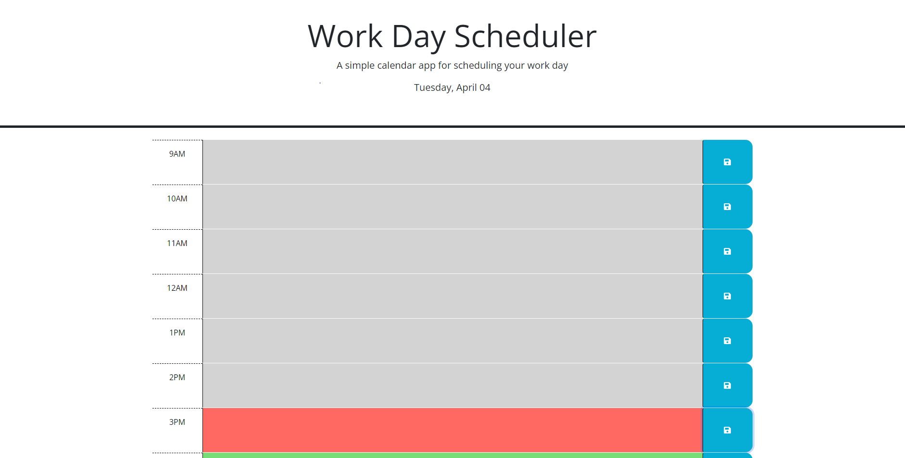

# WeekDay-schedule

## Description

This project is a week day schedule, to better organize your tasks according to the current day and time.

### Actions done
* Classes added according to current hour
* CSS was reorganized to follow a logical structure
* Input saved on local storage and will be presented on the page at refresh
* Current date disply on top page

### Link of deployed application
[Link to the deployed website](https://purplelume.github.io/WeekDay-schedule/)